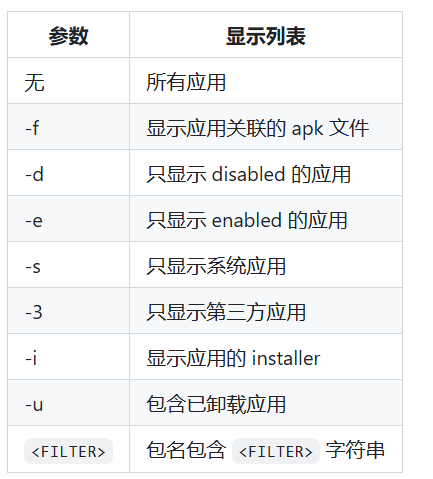
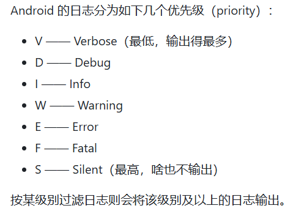

---
This is the study file for awesome-adb.
我们只学习了脚本编写需要的adb语法
---

# adb 基本语法
adb [-d|-e|-s <serialNumber>] <command>
如果只有一个设备/模拟器连接时，可以省略掉 [-d|-e|-s <serialNumber>] 这一部分，直接使用 adb <command>。
1. 下面解释各个参数的含义
   1. -d
      1. 指定唯一通过usb连接的设备
   2. -e
      1. 指定模拟器
   3. -s <serialNumber>
      1. 指定相应 serialNumber 号的设备/模拟器为命令目标

## 获取serialNumber
```sh
adb devices

List of devices attached
cf264b8f	device
emulator-5554	device
10.129.164.6:5555	device
```
这时候，如果我们想要单独为第三个设备下载一个安装包
```sh
adb -s 10.129.164.6:5555 install test.apk
```
##  启动停止server、指定网络端口
```sh
adb start-server
adb kill-server
adb -P <port> start-server
```

## 获取包名/查看引用列表
```sh
adb shell pm list packages [-f] [-d] [-e] [-s] [-3] [-i] [-u] [--user USER_ID] [FILTER]
```
这是过滤参数

1. 常用：
   1. -s 系统应用
   2. -3 第三方应用

### 查找指定字符串
直接查找：
```sh
adb shell pm list packages <the part of filename>
```
grep 方法:
```sh
adb shell pm list packages | grep <the part of filename>
```
这里 | 表示管道符，表示将左边的输出传给右边的grep函数进行过滤
```sh
grep -i azur
```
我们也可以加上 -i 参数来忽略大小写

##  启动应用/ 调起 Activity
```sh
adb shell am start [options] <INTENT>
```
options 用于控制 Activity 的启动方式和行为，例如是否等待启动完成、是否清空任务栈、是否在新任务中启动等。它们可以让你精确地模拟用户操作或满足测试/调试需求。当然，脚本编写并不需要
1. 常用options
   1. -W
      1. 等待 Activity 完全启动后再返回。常用于测量冷启动时间或确保下一个命令在界面可见后执行
   2. -S
      1. 强制杀死应用进程后再启动。相当于“冷启动”
INTENT（意图） 是 am start 的核心参数，它描述了要启动哪个组件（Activity）以及携带什么数据。简单说：options 控制“怎么启动”，INTENT 决定“启动什么”。
### 显式启动
```sh
-n <package>/<activity_class>
```
这里，需要知道包名，以及要操作的活动的类名

### 直接启动主activity（monkey指令）
```sh
adb shell monkey -p <packagename> -c android.intent.category.LAUNCHER 1
```
1. 解释参数：
   1. monkey
      1. 工具名
   2. -p <packagename>
      1. 包名
   3. -c android.intent.category.LAUNCHER
      1. 指定 Intent 的 Category 为 LAUNCHER，即只筛选出属于启动器类别的 Activity
   4. 1
      1. 随机事件数量为1
### 调起、停止 Service
### 发送广播


## 模拟按键/输入
### 按键代码方法
```sh
adb shell input keyevent <keycode>
```
https://developer.android.com/reference/android/view/KeyEvent.html
上面是keycode对应事件，在这里我们不需要过多的了解，因为我们不会使用
```sh
tap <x> <y> (Default: touchscreen)
swipe <x1> <y1> <x2> <y2> [duration(ms)] (Default: touchscreen)
press (Default: trackball)
roll <dx> <dy> (Default: trackball)
```
以上分别对应：
**点击对应坐标**
**从1位置滑动到2位置**
后面涉及轨迹球，不常用


## 日志
Android 的日志输出到 /dev/log。
```sh
adb logcat [<option>] ... [<filter-spec>] ...
```


### 优先级



### <filter-spec>
\<filter-spec> 可以由多个 <tag>[:priority] 组成
 例如
```sh
adb logcat ActivityManager:I MyApp:D *:S
```
就是输出ActivityManager I优先级以上的日志，Myapp S级以上的日志


### 日志格式
这是__option__里的一个功能
adb logcat -v <format>
format是一个输出格式标志，常见有如下
1. brief
   1. <priority>/<tag>(<pid>): <message>
2. tag
   1. <priority>/<tag>: <message>
3. time
   1. <datetime> <priority>/<tag>(<pid>): <message>


### 清空日志
```sh
adb logcat -c
```
## 获取信息

### 屏幕分辨率
```sh
adb shell wm size
```
### 屏幕密度
```sh
adb shell wm density
```
### 屏幕截屏
```sh
adb exec-out screencap -p > sc.png
```
表示将截图存到电脑中。命名为sc.png
如果你在 C:\Users\你的用户名> 下执行，文件就会保存在 C:\Users\你的用户名\sc.png
也可以写绝对路径
```sh
adb exec-out screencap -p > D:\screenshots\sc.png
```
也可以使用相对路径
假设当前在 /home/user/project 目录下：
```sh
# 保存到当前目录下的 screenshots 文件夹中（需要该文件夹已存在）
adb exec-out screencap -p > screenshots/sc.png
```
如果没有文件夹，会报错，需要用os方法mkdir